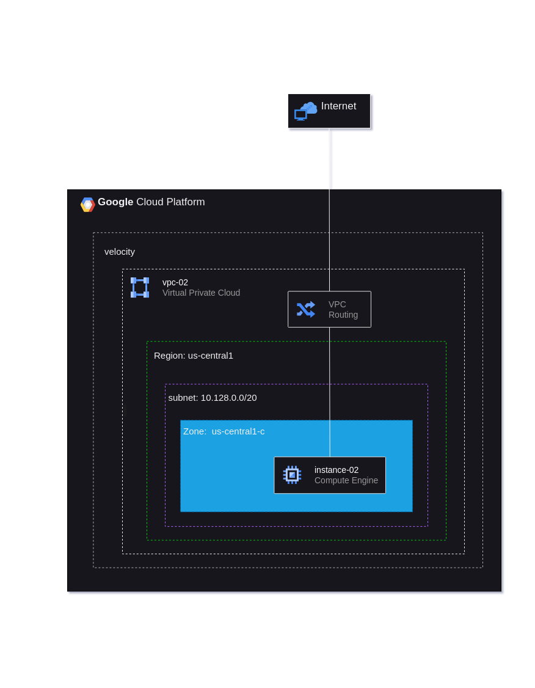

# Creating a VPC Network in GCP Console

## Step 1: Sign in to the Google Cloud Console
1. Navigate to [Google Cloud Console](https://console.cloud.google.com/).
2. Log in with your credentials if you aren't already logged in.

## Step 2: Navigate to the VPC Networks Section
1. Once logged in, click on the **Navigation Menu** (three horizontal lines) in the top-left corner.
2. From the drop-down, go to **VPC network** under the **Networking** section.
3. Click on **VPC networks**.

## Step 3: Create a New VPC Network
1. At the top of the **VPC networks** page, click the **Create VPC network** button.
   
## Step 4: Configure VPC Network Details
1. **Name**: Set the name to `mynetwork`.
2. **Subnet creation mode**: Click on **Automatic**.
   - Auto mode creates subnets in each region automatically, similar to the default network.

## Step 5: Configure Firewall Rules
1. In the **Firewall rules** section, check all available firewall rule options, such as:
   - **Allow ICMP**
   - **Allow internal traffic**
   - **Allow RDP (3389)**
   - **Allow SSH (22)**
   
   These rules replicate the standard firewall rules that come with the default network.
   
2. You will also see two implied rules:
   - **deny-all-ingress**: Blocks all incoming traffic.
   - **allow-all-egress**: Allows all outgoing traffic.
   
   These cannot be unchecked as they are system-generated but have lower priority compared to the custom allow rules.

## Step 6: Create the VPC Network
1. Review the configuration and click **Create**.
2. Wait for `mynetwork` to be created.

## Step 7: Verify the VPC Network
1. Once the network is created, you will be redirected to the **VPC networks** page.
2. You will notice that subnets have been automatically created for each region.
3. Click on the **mynetwork** name and record the **IP address range** for subnets in different regions. These details will be used when creating resources like VM instances.

## Step 8: Recreating the Default Network (Optional)
- If the default network is ever deleted, you can recreate it by following the same process of creating an auto mode VPC network, as described above.

## Setting Up VPC Using gcloud Commands

### Step 9: Set Environment Variables
You can use the following script to create a VPC network and associated firewall rules using the `gcloud` command-line tool:

```bash
gcloud compute networks create vpc-02 --project=velocity-406304 --description=example\ vpc\ for\ learning.\ created\ by\ sritam --subnet-mode=auto --mtu=1460 --bgp-routing-mode=regional --bgp-best-path-selection-mode=legacy

gcloud compute firewall-rules create vpc-02-allow-custom --project=velocity-406304 --network=projects/velocity-406304/global/networks/vpc-02 --description=Allows\ connection\ from\ any\ source\ to\ any\ instance\ on\ the\ network\ using\ custom\ protocols. --direction=INGRESS --priority=65534 --source-ranges=10.128.0.0/9 --action=ALLOW --rules=all

gcloud compute firewall-rules create vpc-02-allow-icmp --project=velocity-406304 --network=projects/velocity-406304/global/networks/vpc-02 --description=Allows\ ICMP\ connections\ from\ any\ source\ to\ any\ instance\ on\ the\ network. --direction=INGRESS --priority=65534 --source-ranges=0.0.0.0/0 --action=ALLOW --rules=icmp

gcloud compute firewall-rules create vpc-02-allow-rdp --project=velocity-406304 --network=projects/velocity-406304/global/networks/vpc-02 --description=Allows\ RDP\ connections\ from\ any\ source\ to\ any\ instance\ on\ the\ network\ using\ port\ 3389. --direction=INGRESS --priority=65534 --source-ranges=0.0.0.0/0 --action=ALLOW --rules=tcp:3389

gcloud compute firewall-rules create vpc-02-allow-ssh --project=velocity-406304 --network=projects/velocity-406304/global/networks/vpc-02 --description=Allows\ TCP\ connections\ from\ any\ source\ to\ any\ instance\ on\ the\ network\ using\ port\ 22. --direction=INGRESS --priority=65534 --source-ranges=0.0.0.0/0 --action=ALLOW --rules=tcp:22

```


# Creating a VM Instance in Google Cloud Console

This guide outlines the steps to create a Virtual Machine (VM) instance in Google Cloud Console using a pre-existing VPC network.

## Prerequisites
- A Google Cloud account.
- A created VPC network (e.g., `vpc-02`) with appropriate firewall rules.

## Step 1: Sign in to Google Cloud Console
1. Navigate to [Google Cloud Console](https://console.cloud.google.com/).
2. Log in with your credentials if you aren't already logged in.

## Step 2: Navigate to the Compute Engine Section
1. Click on the **Navigation Menu** (three horizontal lines) in the top-left corner.
2. Select **Compute Engine** from the drop-down.
3. Click on **VM instances**.

## Step 3: Enable Compute Engine API (if needed)
1. If prompted, click on **Enable** to activate the Compute Engine API. This may take a few minutes.

## Step 4: Create a New VM Instance
1. Click on the **Create instance** button at the top of the VM instances page.

## Step 5: Configure Instance Details
1. **Name**: Enter a name for your VM instance (e.g., `my-vm-instance`).
2. **Region and Zone**: Select the region and zone where you want to create the instance. Ensure it matches one of the regions where your VPC subnets are available.
3. **Machine configuration**: Choose the machine type based on your needs (e.g., `e2-medium`, `n1-standard-1`, etc.).

## Step 6: Configure Networking
1. In the **Networking** section, click on the **Network interface** dropdown.
2. Select the VPC network you created earlier (e.g., `vpc-02`).
3. **Subnet**: Choose the appropriate subnet from the dropdown. This will be one of the subnets created in your VPC network.
4. **External IP**: Choose whether you want to assign an external IP to the VM. If you need to access it from the internet, select **Ephemeral** or **Static** as per your requirements.

## Step 7: Configure Firewall Rules
1. In the **Firewall** section, check the boxes for:
   - **Allow HTTP traffic** (if needed).
   - **Allow HTTPS traffic** (if needed).
   - Ensure your firewall rules allow the necessary traffic (e.g., SSH, RDP) for your VM to function as intended.

## Step 8: Additional Configuration (Optional)
1. You can configure other settings, such as **Boot disk**, **Identity and API access**, and **Management, security, disks, networking, sole-tenancy** as needed.

## Step 9: Create the VM Instance
1. After reviewing your settings, click the **Create** button at the bottom of the page.
2. Wait for the VM instance to be provisioned. You will be redirected to the **VM instances** page where you can see your newly created VM.

## Step 10: Connect to Your VM
1. Once the VM is running, you can connect to it using SSH by clicking the **SSH** button next to your instance on the VM instances page.

---

```bash
gcloud compute instances create instance-02 --project=velocity-406304 --zone=us-central1-f --machine-type=f1-micro --network-interface=network-tier=STANDARD,stack-type=IPV4_ONLY,subnet=vpc-02 --maintenance-policy=MIGRATE --provisioning-model=STANDARD --service-account=893106818560-compute@developer.gserviceaccount.com --scopes=https://www.googleapis.com/auth/devstorage.read_only,https://www.googleapis.com/auth/logging.write,https://www.googleapis.com/auth/monitoring.write,https://www.googleapis.com/auth/service.management.readonly,https://www.googleapis.com/auth/servicecontrol,https://www.googleapis.com/auth/trace.append --create-disk=auto-delete=yes,boot=yes,device-name=instance-02,image=projects/ubuntu-os-cloud/global/images/ubuntu-2004-focal-v20240830,mode=rw,size=10,type=pd-balanced --no-shielded-secure-boot --shielded-vtpm --shielded-integrity-monitoring --labels=goog-ec-src=vm_add-gcloud --reservation-affinity=any
```

## Architecture Diagram


